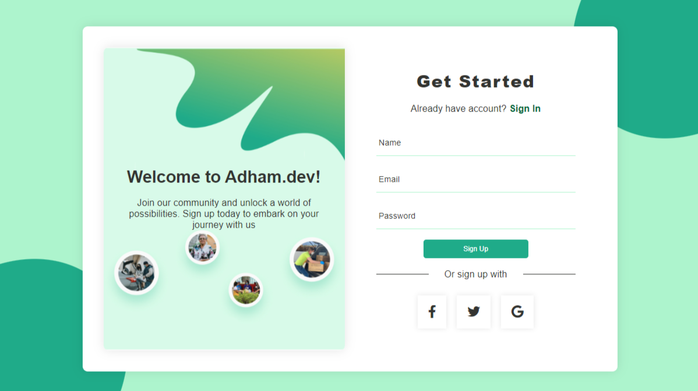

# Sign-Up Page

A simple sign-up page design with HTML and CSS.

 

## Table of Contents

- [Sign-Up Page](#sign-up-page)
  - [Table of Contents](#table-of-contents)
  - [Description](#description)
  - [Demo](#demo)
  - [Installation](#installation)
  - [Usage](#usage)
  - [Credits](#credits)

## Description

This project is a responsive sign-up page designed using HTML and CSS. The page features a card with a welcoming message and a sign-up form where users can enter their name, email, and password. It also provides options to sign up using social media accounts.

## Demo

You can see a live demo of the sign-up page [here](https://sign-up-page-green.vercel.app/).

## Installation

1. Clone the repository or download the ZIP file.
2. Open the `index.html` file in your web browser.

## Usage

1. Open the `index.html` file in a web browser to view the sign-up page.
2. Fill in the required fields (Name, Email, Password) to create an account.
3. Click the "Sign Up" button to submit the form.

## Credits

- Design by Nanda Fadillah.
- Development by [Adham Nasser](https://github.com/Adhamxiii)
- Icon fonts provided by [FontAwesome](https://fontawesome.com/).

